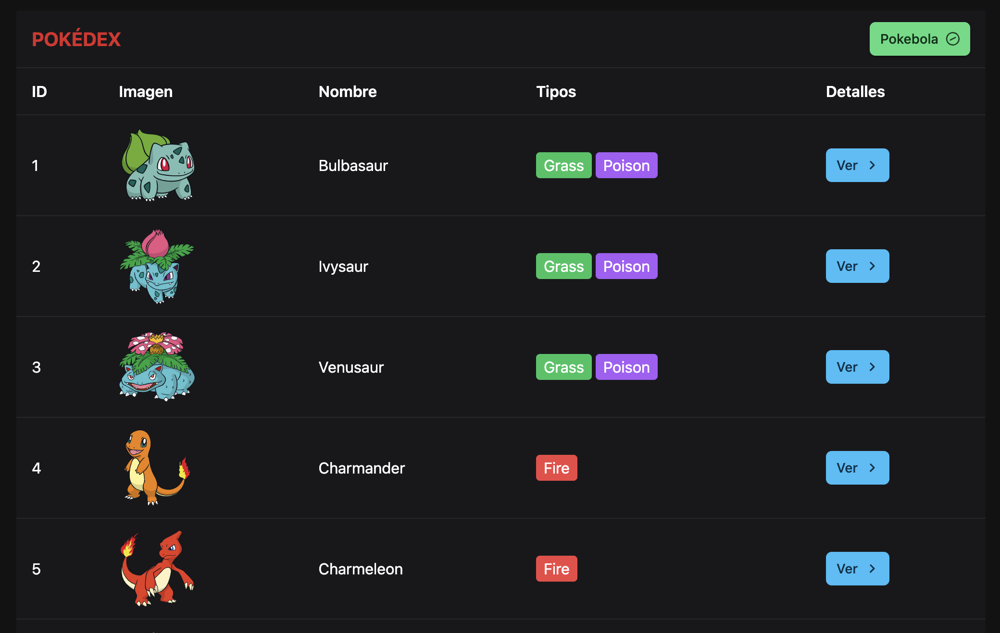
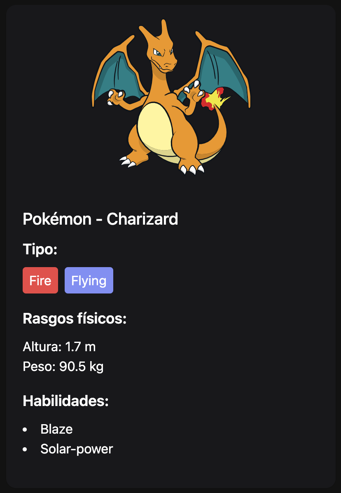

# Pokémon Vue App

## Prueba Técnica para Electro3

¡Bienvenido a Pokémon Vue App!

Este proyecto, desarrollado con Vue.js 3, utiliza la biblioteca de componentes PrimeVue para brindar una experiencia visual atractiva y funcional.

La aplicación muestra los Pokémon disponibles hasta la fecha 19/11/2024, abarcando un total de 1025 Pokémon.

## Funcionalidades Principales 🌟

- **DataTable**: Una tabla dinámica que permite explorar la lista de Pokémon.
- **Dialog**: Ventanas modales para capturar y visualizar Pokémon seleccionados.
- **Card**: Una tarjeta con los detalles del Pokémon seleccionado.
- **Paginación**: Visualización optimizada con 10 Pokémon por página, mejorando la navegación.

## Requisitos de Instalación ⚙️

### Instalar dependencias

```bash
npm install
```

### Levantar el proyecto en modo desarrollo

```bash
npm run dev
```

### Compilar y construir el proyecto para producción

```bash
npm run build
```

### Ejecutar linter y corregir archivos

```bash
npm run lint
```

## Tecnologías Utilizadas 💻

- **Vue.js 3**: Framework progresivo para la construcción de interfaces de usuario.
- **PrimeVue**: Librería de componentes UI moderna y personalizable.
- **Tailwind**: Diseño responsivo y estilización.

## Capturas de Pantalla 📸





¡Gracias por explorar Pokémon Vue App! 😊